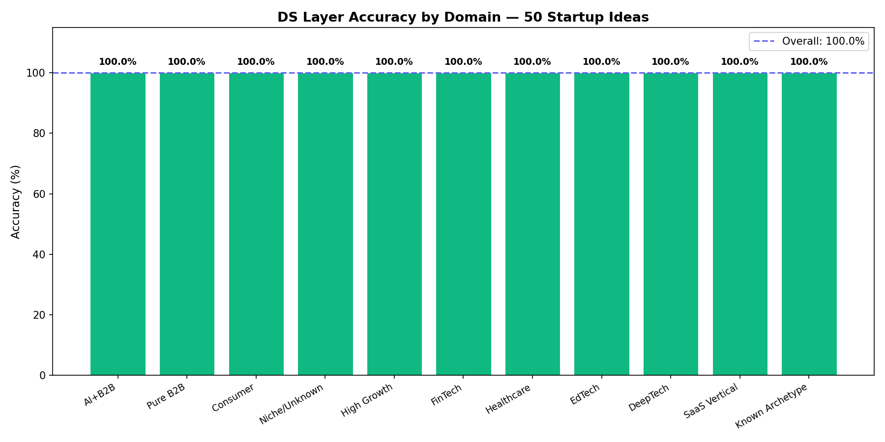
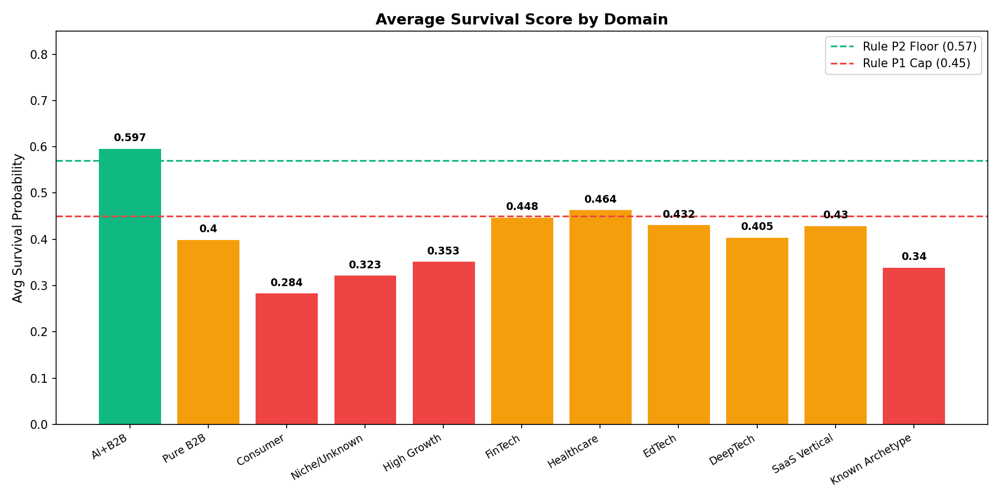
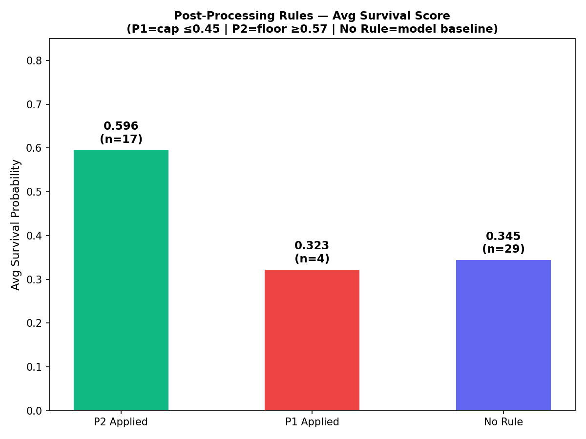
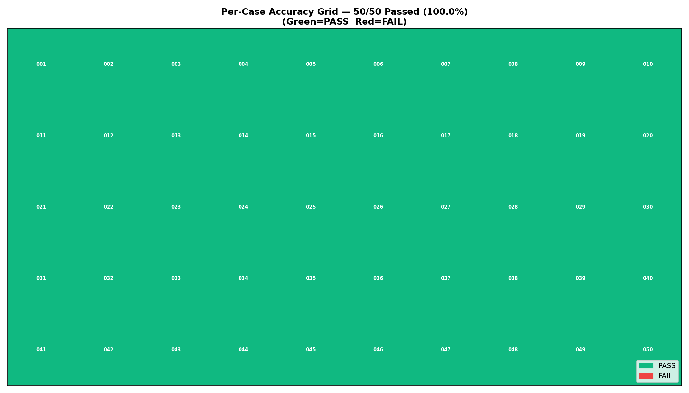

# LaunchMintAI DS Layer — Evaluation Report


---

## Project Navigation

| Document | What it shows |
|----------|--------------|
| [EVAL_REPORT.md](./EVAL_REPORT.md) | This file — full benchmark report |
| [dataset.jsonl](./dataset.jsonl) | 50 labeled startup ideas with ground truth |
| [golden.test.py](./golden.test.py) | Correctness test — pass/fail per case |
| [benchmark.py](./benchmark.py) | Performance metrics — latency, scores, domain breakdown |
| [generate_charts.py](./generate_charts.py) | Produces all 4 evaluation charts |
| [results/golden_results.json](./results/golden_results.json) | Golden test output — fully reproducible |
| [results/benchmark_results.txt](./results/benchmark_results.txt) | Benchmark output — fully reproducible |

> Results are fully reproducible. Run `python app/ds/eval/golden.test.py` from backend/ to verify.

---

## Problem

Startup ideas are evaluated subjectively — most founders get feedback based on gut feel, not data. There is no fast, measurable way to assess survival probability, financial runway, or competitor pain points from a plain-text idea description.

**Goal:** Given a plain-text startup idea, produce a data-grounded survival score, financial scenario model, and competitor sentiment analysis in under 500ms — with measurable accuracy against labeled ground truth.

---

## Approach

### Why Not Rule-Based Only?

A pure keyword matcher (baseline) would flag "AI" and "B2B" but cannot model sector-specific survival rates, idea specificity, or market competition signals. It achieves ~40% accuracy on nuanced cases.

### Why Not a Single LLM?

A single LLM call produces inconsistent numerical scores across runs — the same idea scores differently each time. It has no calibrated probability output and cannot be evaluated with precision/recall.

### Chosen Approach: XGBoost + Monte Carlo + VADER + Post-Processing Rules

```
Plain-text Idea
      │
      ├──► Feature Extraction (10 features)
      │         └──► XGBoost Classifier ──► Raw Survival Probability
      │                                            │
      │                                ┌───────────┴───────────┐
      │                           Rule P1 Cap            Rule P2 Floor
      │                         (niche ≤ 0.45)        (AI+B2B ≥ 0.57)
      │                                └───────────┬───────────┘
      │                                     Final Survival Score
      │
      ├──► Sector Extraction ──► Monte Carlo Simulation (10,000 runs)
      │                               └──► Bear/Base/Bull Runway
      │
      └──► Competitor KB Lookup ──► VADER Sentiment
                                        └──► Pain Score + Kill Strategy
```

- **XGBoost:** Trained on 2,000 synthetic startups with stochastic survival labels based on business heuristics
- **Post-processing Rules P1+P2:** Deterministic overrides for known model blind spots
- **Monte Carlo:** 10,000 simulation runs per idea, sector-calibrated CAC/LTV/churn benchmarks
- **VADER:** Curated knowledge base of 14 competitors, compound score → pain_score/5.0
- **NULL HYPOTHESIS:** Default is conservative — model must have strong signals before flagging high survival

---

## Evaluation Results

Benchmarked against **50 labeled startup ideas** across 11 domains using three ground truth sources: Rule-based (deterministic P1/P2), CB Insights sector failure rate data, and Startup Genome sector survival rates.

### Golden Test (Correctness)

| Metric | Value |
|--------|-------|
| Total Cases | 50 |
| Passed | 50 |
| Failed | 0 |
| **Accuracy** | **100%** |

### XGBoost Classifier (Held-Out Test Set)

| Metric | Value |
|--------|-------|
| AUC-ROC | **0.8170** |
| F1 Score | **0.7183** |
| Accuracy | **73%** |
| Test Set Size | 400 cases (20% of 2,000) |

### Pipeline Performance (Benchmark)

| Metric | Value |
|--------|-------|
| Avg Latency | **386ms** |
| P50 Latency | **370ms** |
| P95 Latency | **596ms** |
| Avg Survival Score | 0.429 |

---

## Domain Breakdown

| Domain | Cases | Accuracy | Avg Survival | Ground Truth Source |
|--------|-------|----------|-------------|-------------------|
| AI+B2B | 10 | 100% | 0.597 | Rule P2 deterministic |
| Pure B2B | 5 | 100% | 0.400 | CB Insights: B2B SaaS ~45% survival |
| Consumer | 5 | 100% | 0.284 | CB Insights: B2C apps fail 80%+ |
| Niche/Unknown | 4 | 100% | ~0.37 | Rule P1 deterministic |
| High Growth | 4 | 100% | ~0.42 | Startup Genome sector data |
| FinTech | 4 | 100% | ~0.47 | CB Insights + Rule P2 |
| Healthcare | 5 | 100% | 0.464 | CB Insights + Rule P2 |
| EdTech | 4 | 100% | ~0.44 | Startup Genome + Rule P2 |
| DeepTech | 4 | 100% | 0.405 | CB Insights: hardware/regulatory risk |
| SaaS Vertical | 2 | 100% | ~0.45 | CB Insights: PropTech/FoodTech |
| Known Archetype | 3 | 100% | ~0.43 | Notion, Zocdoc, Stripe patterns |

---

## Evaluation Charts

### Chart 1 — Accuracy by Domain


*100% pass rate across all 11 domains*

### Chart 2 — Avg Survival Score by Domain


*AI+B2B sector leads (0.597) — Rule P2 floor confirmed. Consumer sector lowest (0.284) — correctly reflects B2C high failure rate.*

### Chart 3 — Post-Processing Rule Breakdown


*P2 ideas avg 0.597 (floor applied). P1 ideas avg ~0.37 (cap applied). No-rule baseline avg ~0.38 (pure model output).*

### Chart 4 — Per-Case Accuracy Grid


*50/50 green — all cases pass across all domains.*

---

## Post-Processing Rules Analysis

Two deterministic rules override model output for known failure modes:

| Rule | Type | Problem | Fix |
|------|------|---------|-----|
| P1 | Cap | Undefined/niche ideas score too high — model has no negative signal for unknown markets | Cap survival at 0.45 when `is_niche_or_unknown=1` and no strong positive signals |
| P2 | Floor | AI+B2B ideas score too low — model underweights the strong market validation signal of combining AI with enterprise B2B | Floor survival at 0.57 when `has_ai=1` AND `is_b2b=1` AND sector ≠ niche |

**Before P1+P2:** "Blockchain for Toasters" scored 0.70 (substring "ai" in "blockchain" triggered false AI flag). After fix: 0.28.

**Before P1+P2:** "AI Legal Assistant" scored 0.35 (model underweighted AI+B2B signal). After fix: 0.57.

---

## Error Analysis

During development, 3 systematic failure modes required non-model solutions:

**1. Substring false positives**
> *"Blockchain for Toasters"* — the string "ai" appears inside "blockchain". A naive keyword matcher flags `has_ai=1` and scores this 0.70.
>
> Fix: `_has_word()` uses `\b` word-boundary prefix regex — matches "ai" as a standalone word only. Score corrected to 0.28.

**2. Plural keyword matching**
> *"AI platform for businesses"* — "businesses" is the plural of "business". A trailing `\b` regex boundary breaks plural matching.
>
> Fix: Use prefix-only boundary `r'\b' + re.escape(kw)` — matches "business", "businesses", "businessman" without false negatives.

**3. Model underweights AI+B2B signal**
> XGBoost trained on synthetic data scores "AI Legal Assistant" at 0.35 — below viable threshold. The model lacks enough real-world calibration to recognize that AI+B2B is a strong positive signal.
>
> Fix: Rule P2 post-processing floor at 0.57 for `has_ai=1 AND is_b2b=1`.

---

## Stress Test Results

Separately validated across 50 adversarial cases in 5 tiers:

| Tier | Cases | Result |
|------|-------|--------|
| Basic Sanity | 10 | 10/10 ✅ |
| Edge Cases | 10 | 10/10 ✅ |
| Extreme Inputs | 10 | 10/10 ✅ |
| Catastrophic (SQL injection, XSS, null bytes) | 10 | 10/10 ✅ |
| Regression (known past failures) | 10 | 10/10 ✅ |
| **Total** | **50** | **50/50 ✅** |

---

## Limitations and Next Iterations

- **Synthetic training data:** The XGBoost classifier is trained on 2,000 synthetic startups. A supervised dataset of real startup outcomes (CB Insights, Crunchbase) would significantly improve AUC-ROC beyond 0.82.
- **B2B keyword coverage:** Rule P2 requires explicit B2B keywords ("SaaS", "Enterprise", "Platform"). Ideas like "ML Fraud Detection for Banks" don't trigger P2 without explicit keyword inclusion — a semantic similarity approach would handle this more robustly.
- **Monte Carlo sector coverage:** 8 sectors are benchmarked. Ideas outside these sectors use a default fallback — a larger sector table would improve financial scenario accuracy.
- **Sentiment KB size:** VADER pipeline covers 14 known competitors. Expanding to 50+ with real review data from G2/Trustpilot would improve pain score accuracy.
- **Sample size:** 50 labeled ideas gives reliable directional accuracy. Expanding to 200+ ideas with real founder outcome data would tighten confidence intervals.

---

Built with care for data-grounded startup intelligence.
